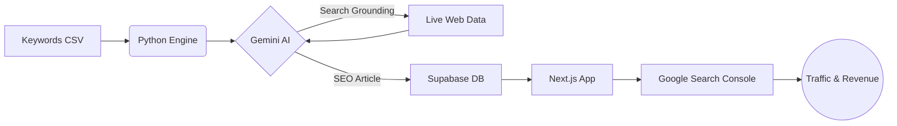

# SistemasPara.com — Massive SEO B2B Directory


> **The ultimate automated engine for B2B software discovery.** Powered by AI, built for scale, and optimized for high-conversion SEO traffic.

[](https://nextjs.org/)
[](https://tailwindcss.com/)
[](https://supabase.com/)
[](https://deepmind.google/technologies/gemini/)

---

## 🚀 The Vision: Mass-Scale Growth
SistemasPara is not just a directory; it's a **programmatic SEO powerhouse**. Our mission is to dominate the B2B software search space by generating high-quality, research-backed articles at an unprecedented scale.

- **🎯 Goal:** Generate **1,000+ unique SEO articles per day**.
- **📈 Strategy:** Capture long-tail "Software for [Industry]" keywords.
- **💰 Monetization:** Scale traffic to maximize **Google AdSense** revenue and high-ticket **Affiliate** conversions.

---

## 🧠 The Engine: Gemini AI Integration
Unlike generic AI scrapers, SistemasPara uses a sophisticated **two-pass research pipeline** powered by **Gemini 2.5 Flash** with **Google Search Grounding**.

### How it Works:
1.  **Step 1: Grounded Research** 🔍
    The engine searches the live web for *real* software tools, pricing models, and specific features for a given industry. No hallucinations—just real data.
2.  **Step 2: SEO Composition** ✍️
    A "Senior B2B SEO Editor" persona takes the research notes and crafts a 1,000-word article with semantic HTML, JSON-LD, and conversion-optimized structure.
3.  **Step 3: Automated Deployment** ⚡
    Articles are upserted into **Supabase** and instantly served via **Next.js ISR (Incremental Static Regeneration)** for lightning-fast performance and perfect indexing.

---

## 🛠️ Technical Stack

### Core Technologies
- **Frontend:** Next.js 16 (App Router) + TypeScript.
- **Styling:** Tailwind CSS v4 (Modern, high-performance CSS).
- **Database:** Supabase (PostgreSQL with RLS).
- **Automation:** Python 3.12 + `google-genai` + `pandas`.

### Architecture


---

## ⚙️ Development Setup

### 1. Web Application
```bash
# Install dependencies
npm install

# Setup environment
cp .env.example .env.local
# Add your Supabase & Gemini credentials

# Start development
npm run dev
```

### 2. SEO Motor (The Generator)
```bash
cd scripts
python3 -m venv .venv
source .venv/bin/activate
pip install -r requirements.txt

# Run a validation test
python generate_pages.py --limit 1 --dry-run

# Start massive generation
python generate_pages.py
```

---

## 📂 Project Structure
- `app/` - The Next.js application (Dynamic routes for mass pages).
- `scripts/` - The Python-based AI generation engine.
- `lib/` - Shared database and SEO helpers.
- `supabase/` - Database migrations and schema definitions.
- `design.md` - UI/UX standards and brand guidelines.

---

## 🌐 Deployment
The project is optimized for **Vercel** with the following configuration:
- **Region:** `gru1` (São Paulo) to minimize latency with Supabase.
- **ISR:** Pages are cached and revalidated every hour to ensure freshness without sacrificing speed.

---

<p align="center">
  Built with ❤️ for the future of programmatic SEO.
</p>
